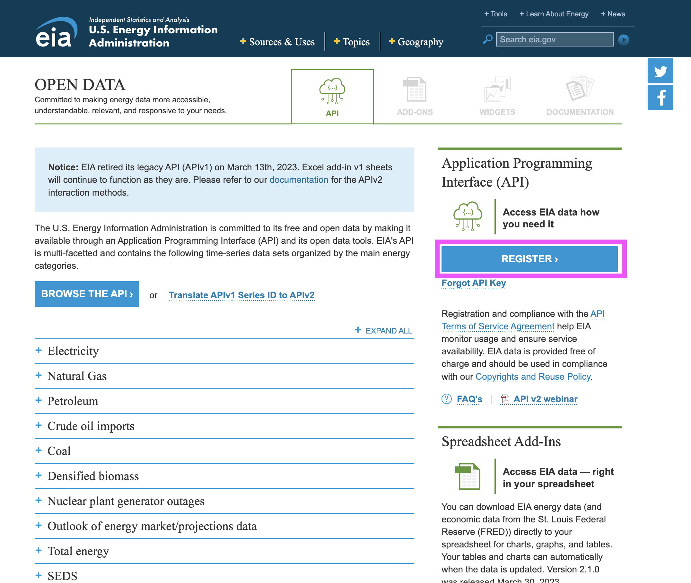
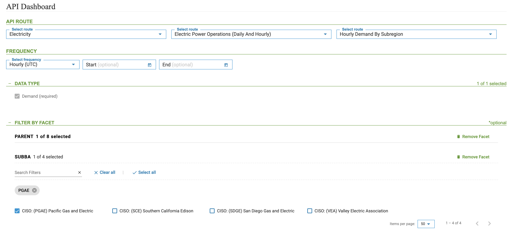
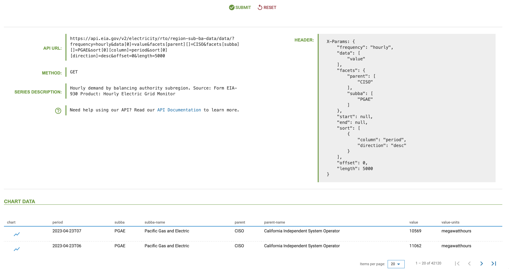

```{r, include = FALSE}
knitr::opts_chunk$set(
  collapse = TRUE,
  comment = "#>"
)
```


The [U.S. Energy Information Administration](https://www.eia.gov/) (EIA) hosts a variety of time series data describing the U.S. energy sector. The EIA data is open and accessible through an Application Programming Interface (API) for free. The **EIAapi** package provides functions to query and pull tidy data from the [EIA API
v2](https://www.eia.gov/opendata/).


## Prerequisites

To pull data from the API using this package, you will need the following:

-   **jq** - The package uses [jq](https://stedolan.github.io/jq/) to parse the API output from JSON to tabular format. To download and install jq follow the
instructions on the [download
page](https://stedolan.github.io/jq/download/).
-   **API key** - To query the EIA API, you must register to the
service to receive the API key.


To register to the API, go to https://www.eia.gov/opendata/, click the `Register` button, and follow the instructions (see the screenshot below).

<br>

<a href="https://www.eia.gov/opendata/browser/"></a>


## Getting started with the EIAapi

The EIAapi package provides the following functions:

- `eia_metadata` - Returns information and metadata from the API about the available categories and subcategories (routes) 
- `eia_get` - Enables query data from the API

A good place to start exploring the available categories and subcategories of the API is on the [API Dashboard](https://www.eia.gov/opendata/browser/). For example, let's explore the hourly demand for electricity in the California sub-region in the dashboard and use the metadata to set the query parameters. Let's start by set the `API Route` to `Electricity` -> `Electric Power Operrations (Daily And Hourly)` -> `Hourly Demand Subregion`, as shown in the screenshot below. Once the data route is set, define the `PARENT` facet as `CISO`. This will filter the options in the next facet - `SUBBA` to the four operators in California. Let's select `CISO: (PGAE) Pacific Gas and Electric` and save the selection:


<br>

</a>

<br>

Once finalize the routes,facets, and any other filters, you can submit the query and you should receive the API metadata. For the selection above, here is the expected respond:

<br>

</a>

<br>

Let's look at the returned metadata above and use it to set the query to pull the data, starting with the `API URL`:

``` HTML
https://api.eia.gov/v2/electricity/rto/region-sub-ba-data/data/?frequency=hourly&data[0]=value&facets[parent][]=CISO&facets[subba][]=PGAE&sort[0][column]=period&sort[0][direction]=desc&offset=0&length=5000
```
The URL contains the following components:

- The API endpoint - `https://api.eia.gov/v2/`
- The data path - `rto/region-sub-ba-data/data/`
- The query - `?frequency=hourly&data[0]=value&facets[parent][]=CISO&facets[subba][]=PGAE&sort[0][column]=period&sort[0][direction]=desc&offset=0&length=5000`

We will use the data path to set the `api_path`. To set the query parameters, you can use the embedded query in the URL by extracting the values of the different filters (frequency, facet, etc.) or use the query header on the right side:

``` json

X-Params: {
"frequency": "hourly",
"data": [
"value"
],
"facets": {
"parent": [
"CISO"
],
"subba": [
"PGAE"
]
},
"start": null,
"end": null,
"sort": [
{
"column": "period",
"direction": "desc"
}
],
"offset": 0,
"length": 5000
}
```

We can now set the query by defining the `frequency`, `data`, and `facets` arguments as defined in the header above:


```{r setup}
library(EIAapi)

df1 <- eia_get(api_key = Sys.getenv("eia_key"),
               api_path = "electricity/rto/region-sub-ba-data/data/",
               frequency = "hourly",
               data = "value",
               facets = list(parent = "CISO",
                             subba = "PGAE"),
               offset = 0,
               length = 5000)

head(df1)

unique(df1$parent)
unique(df1$subba)
```


**Note:** The API limit the number of observations per a call to 5000. If you wish to pull more than 5000 observations you can iterate your call and set the `start` and `end` arguments as a rolling window function. Similarly, you can use the `length` and `offset` arguments to define the rolling function.


## API metadata

The EIA API provides detailed information and metadata about the categories and time series available in the API. This enables extracting information programmatically about different data parameters. The eia_metadata enables query metadata from the API. The function has two arguments:

- `api_path` - the API category/route path following the API endpoint (i.e., `https://api.eia.gov/v2/`)
- `api_key` - the API key

### Category metadata

Querying metadata is done by sending a request with a specific route path, and the API, in response, returns the available sub-categories under that path. For example, setting the `api_path` argument empty or `NULL` returns a list with the API main categories:


```{r}
main_route <- eia_metadata(api_path = "",
                           api_key = Sys.getenv("eia_key"))

main_route$routes[, c("id", "name")]
```


Similarly, we can continue and extract the sub-categories under the electricity category by setting the `api_path` argument to `electricity`:

```{r}
main_route <- eia_metadata(api_path = "electricity",
                           api_key = Sys.getenv("eia_key"))

main_route$routes[, c("id", "name")]
```

**Note:** the number of sub-categories or routes varies between the different categories.

### Series metadata

The last route in the API path defines the series available under those categories. For example, we used the above to pull the hourly demand for electricity by sub-region the following URL:
``` html
https://api.eia.gov/v2/electricity/rto/region-sub-ba-data/data/?frequency=hourly&data[0]=value&facets[parent][]=CISO&facets[subba][]=PGAE&sort[0][column]=period&sort[0][direction]=desc&offset=0&length=5000
```

In this case, the path is defined as - `electricity/rto/region-sub-ba-data/`, where: 

- `electricity` is the main category
- `rto` - is the sub-category under electricity representing the Electric Power Operations (Daily and Hourly), and 
- `region-sub-ba-data` - is the last sub-category in this route, representing the Hourly Demand by Sub-region 

You can notice that the last sub-category in this path - `region-sub-ba-data` ended with `data` to indicate to the user that this is the last route, and under it there is data. The metadata for the time series has a different structure with respect to the category metadata. It provides useful information such as:
- Starting and ending time of the series
- Available facets
- Series Frequency

For example, let's query for Demand by Sub-region metadata:


```{r}
elec_sub_route <- eia_metadata(api_path = "electricity/rto/region-sub-ba-data/",
                               api_key = Sys.getenv("eia_key"))

elec_sub_route 
```

You can continue and query additional information on this series. For example, let's extract the list of balancing authorities that are available for this series under the `parent` facet:

```{r}
 eia_metadata(api_path = "electricity/rto/region-sub-ba-data/facet/parent",
                               api_key = Sys.getenv("eia_key"))
```

